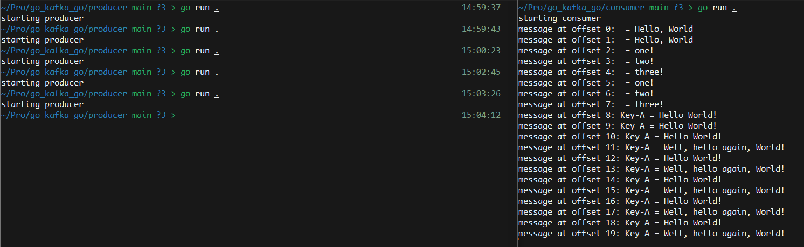

# Go, Kafka, go!

This is just an example project for testing Kafka related functionalities. Currently, only used with Golang, but will probably
extend with other languages such as C++ or Rust.

## Prerequisite ##
Before we start, Kafka needs to be installed (duh!). Here are the installation guides for [Ubuntu](https://www.digitalocean.com/community/tutorials/how-to-install-apache-kafka-on-ubuntu-20-04) and [Windows](https://www.confluent.io/blog/set-up-and-run-kafka-on-windows-linux-wsl-2/).
Also, for this example, [Golang](https://go.dev/doc/install) is needed so make sure you have that also installed.

## Usage ##
1. Open two separate command prompts (terminals)
2. In the **first** one, navigate to the `consumer` folder and execute:
```shell
~/consumer> go run .
```
3. In the **second** windows, navigate to `producer` and execute the same command as above.

The picture below shows how the message queue looks like (after the `consumer` is run) after the `producer` is run several times


## Note ##
If you're running Kafka on a dedicated server, there is an issue with the default host name resolver in Go.
To circumvent this, just use the **pure Go resolver** (instead of the native one). This can be accomplished by adding the
following **environment** variable:
```
GODEBUG=netdns=go
```

More on that can be seen [here](https://pkg.go.dev/net#hdr-Name_Resolution).